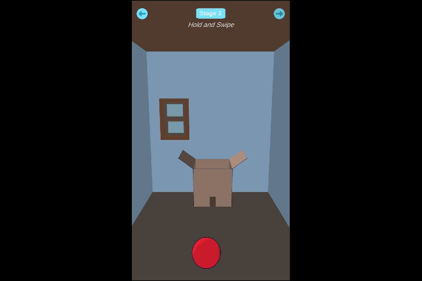
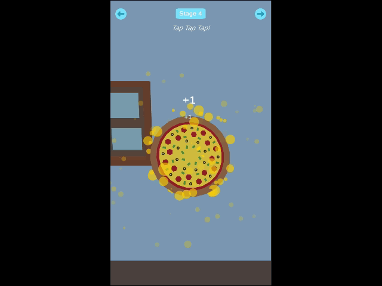

# Unity Mobile Touch Samples

This repository contains a Unity project with different mobile touch controls in a 3D world space, can be used in a hyper casual game, as a reference prototype or any other.

Starting with basic controls there's: 
## Drag and Drop

### Stage 1
Drag the food on the shelves and drop them in the cardboard box. You can only drag food objects.

 
    

## Move,Hold and Swipe

### Stage 2
Move the ball left , right , forward, backward. (XZ direction)
Hold to lift the ball and swipe forward to throw it in the cardboard box.

 
    

## Basic Joystick Movement

### Stage 3
Move the marble in the maze.

 
    

## Tap 
### Stage 4
Like cookie tapper, tap on pizza to see more effects. This event only takes single tapping.

 
    

##  INSTRUCTIONS

This project is made for Unity 2019.2 and up.

"It’s important to note that a long-standing property of the Touch system has been removed. From Unity 2019.2 onward, touch is no longer detected as a mouse click." - *Unity Technologies*

This project is updated to the latest Unity mobile touch system. Can be used on both Android and IOS.

>**Note:**  You can only test the touch functionality on your mobile.Touch events won't work using the mouse while in Unity's editor, so to avoid doing a lot of builds each time you want to test you can use **[Unite Remote 5](https://docs.unity3d.com/Manual/UnityRemote5.html)** to directly test on your phone while you hit the play button in Unity's editor.

**How to setup Unity Remote 5 ?**
- In your Unity project ,change the build settings to Android or IOS (depends on your phone) **File > Build Settings**
- Open Play store or App store on your phone and download *Unity Remote 5*
- Launch *Unity Remote 5* and then connect your phone with a USB cable to your computer.
- In Unity go to **Edit > Project Settings > Editor** , in the *Device* option choose "Any Android Device" or your IOS Device
- Now hit play in the Unity editor , it should take seconds to connect

>**Note:**  *Unity Remote 5* is only to test functionalities and debug errors. You will see low res graphics because the Remote app simply shows the visual output on the device and takes input from it. The game’s actual processing is still done by the Editor on the desktop machine - so it's performance is not a perfect reflection of the built app.

**Project Setup**
1. Open your project with Unity
2. Test the gameplay on your mobile, you can use Unity Remote 5 for direct testing.

This project is divided into stages. Each stage has a different mobile touch control, the code for the controls can be found in **StageInfo** script. Pick any control you would like to use in your game and modify/enhance upon your need.

I will update the project with new stages in the future, feel free to recommend some controls you would like to use.

Used :
1. Dotween , it's ideal for hyper casual games as it's fast and smooth for controlling moving objects, and will be using it more in the future stages, for more info check [Dotween site](http://dotween.demigiant.com/getstarted.php)  .
2. JMO Assets, it has cool particle effects and it's free , can be found in Unity Asset store [here](https://assetstore.unity.com/packages/vfx/particles/cartoon-fx-free-109565) .
3. TextMeshPro from Unity.
4.  Models are from Kenney's Assets big thanks to Kenney. You can check his assets [here](https://www.kenney.nl/)

---
Thank you for reading this, I hope you find this project useful.
Feel free to subscribe to my [Youtube Channel](https://www.youtube.com/channel/UC8ZB1WjdDT2TsFeQEEEtUhA?view_as=subscriber) for future tutorials.

